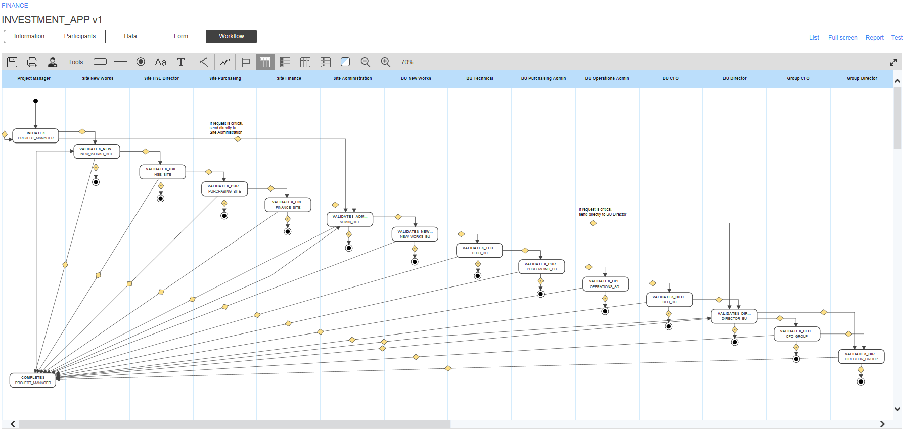
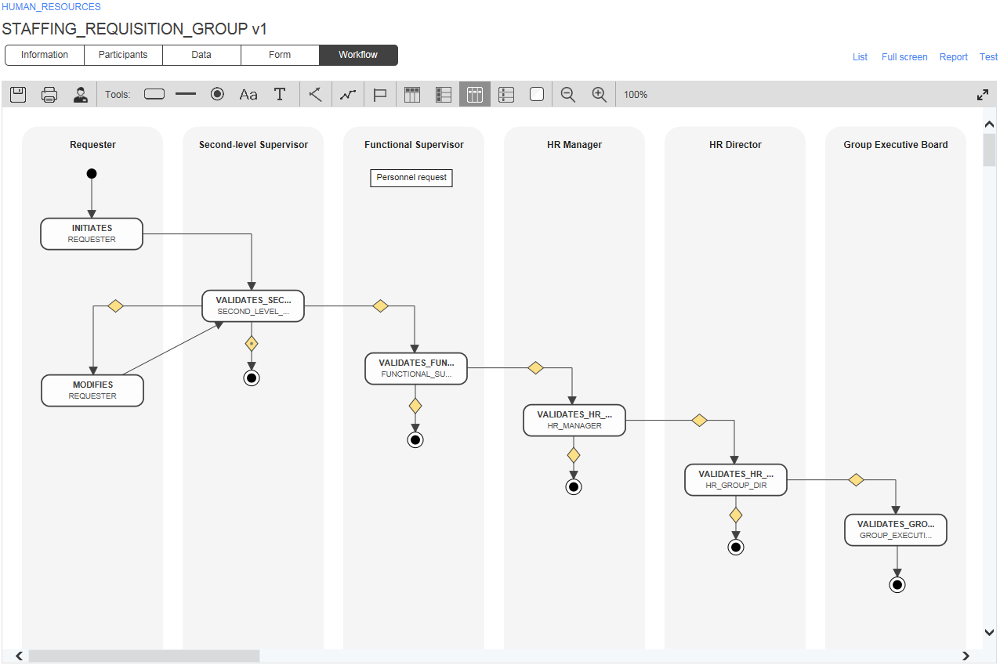
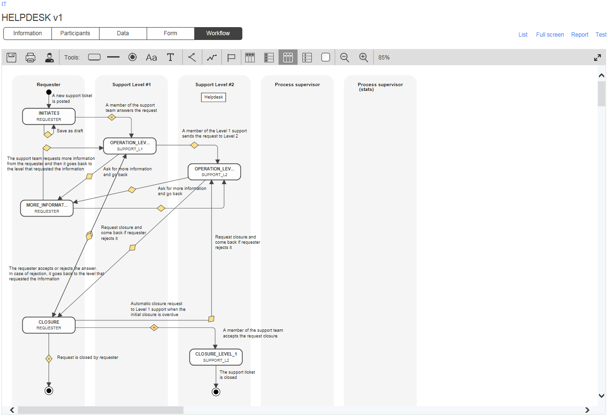
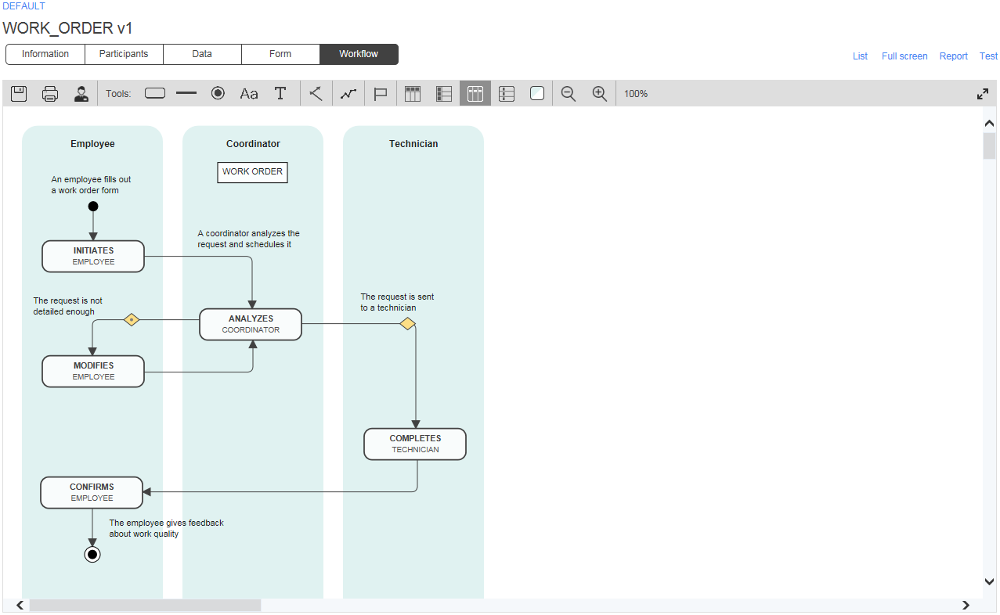
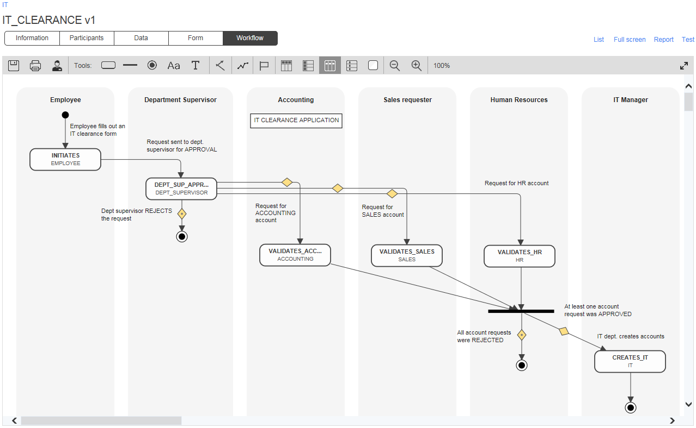

# Business Process Template Library

The [WorkflowGen](https://www.workflowgen.com/) workflow management software comes with built-in, ready-to-use business process templates that you can easily customize to meet your needs and put into production in no time. The following templates provide additional examples of processes, including their objectives, the participants involved in the workflow, the expected benefits to your organization, and examples of value-added integration.

You can download process templates and try them out for yourself to see how WorkflowGen can meet all of your business process needs with quick and easy customization and seamless integration. If you have not already installed WorkflowGen, simply request a free trial version.

## Investment Application

The objective of this process is to manage and optimize the various steps in an investment application. [More...](processes/investment-application)

## Staffing Requisition

The objective of this process is to dematerialize and optimize the management of staffing requisitions. This is the first part of a series of processes that can be linked, leading to the hiring of a new employee. [More...](processes/staffing-requisition)

## New Product Creation

The objective of this process is to manage and optimize the various steps in the creation of a new product. [More...](processes/product-creation)

## Helpdesk Request

The objective of this process is to manage and optimize the handling, processing, and resolution of IT Helpdesk requests from internal and external clients. [More...](processes/helpdesk-request)

## Work Order

The objective of this process is to manage and optimize works and repairs in company buildings and facilities, academic campuses, and geographic areas managed by local governments. [More...](processes/work-order)

## IT Clearance

The objective of this process is to manage and optimize requests for IT clearance for applications managed by different departments within the company. [More...](processes/it-clearance)

