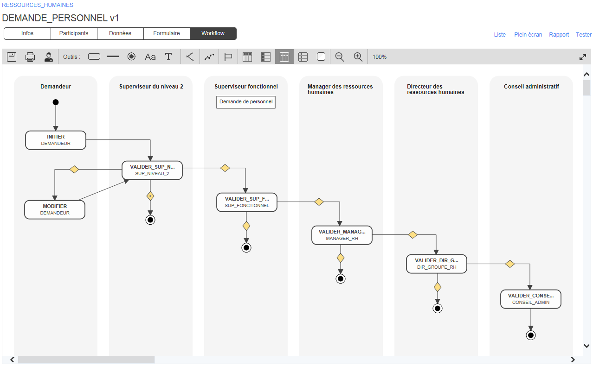
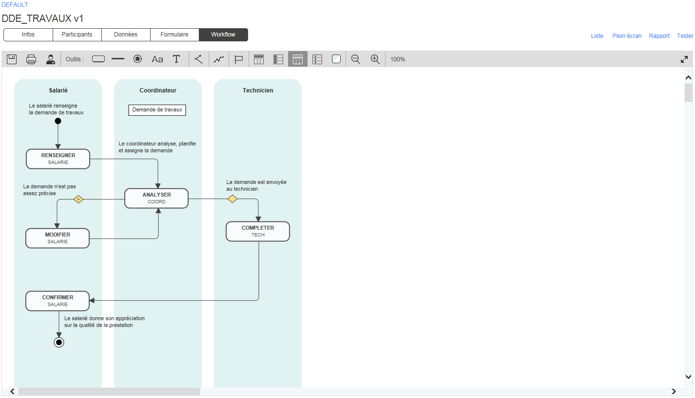
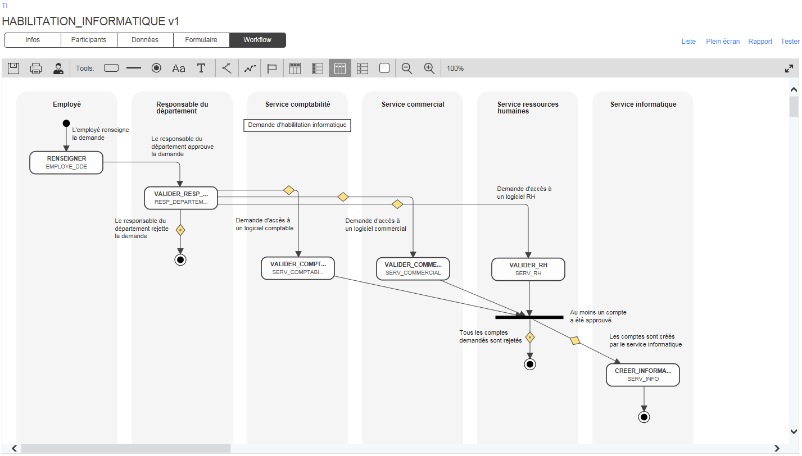

# Bibliothèque de processus

[WorkflowGen](https://www.workflowgen.com/fr) est fourni avec des exemples de processus clés-en-main intégrés que vous pouvez facilement personnaliser selon vos besoins et mettre en production en un clin d’œil. La bibliothèque suivante contient d’autres exemples de processus avec pour chacun d’eux les objectifs, les participants impliqués dans le workflow, les bénéfices attendus et des exemples d’intégrations à valeur ajoutée.

Vous pouvez télécharger les exemples de processus et les tester afin de voir comment WorkflowGen peut répondre à vos besoins d’automatisation de processus métiers avec une personnalisation rapide et facile et une intégration transparente. Si vous n’avez pas encore installé WorkflowGen, vous pouvez tout simplement demander une version d’évaluation gratuite.

## Demande de personnel

L’objectif de ce processus est de dématérialiser et d’optimiser la gestion des demandes de personnel. Ce processus est le premier d’une série qui peuvent être liés, menant à l’embauche d’un nouvel employé. 

[Accéder à l’exemple de processus](processus/demande-personnel/README.md)

## Création d’un nouveau produit

L’objectif de ce processus est de gérer et d’optimiser les diverses étapes de la création d’un nouveau produit. 

[Accéder à l’exemple de processus](processus/creation-produit/README.md)

## Demande de support informatique

L’objectif de ce processus est de gérer et d’optimiser la prise en charge, le traitement et la résolution des demandes de support informatique des clients internes et externes. 

[Accéder à l’exemple de processus](processus/demande-support-informatique/README.md)

## Demande de travaux

L’objectif de ce processus est de gérer et d’optimiser les travaux et les réparations dans les édifices et les installations d’une entreprise, sur les campus universitaires et dans les zones géographiques gérées par des collectivités territoriales. 

[Accéder à l’exemple de processus](processus/demande-travaux/README.md)

## Demande d’habilitation informatique

L’objectif de ce processus est d’optimiser le traitement des demandes d’habilitation informatique qui concernent plusieurs départements de l’entreprise. 

[Accéder à l’exemple de processus](processus/demande-habilitation-informatique/README.md)

