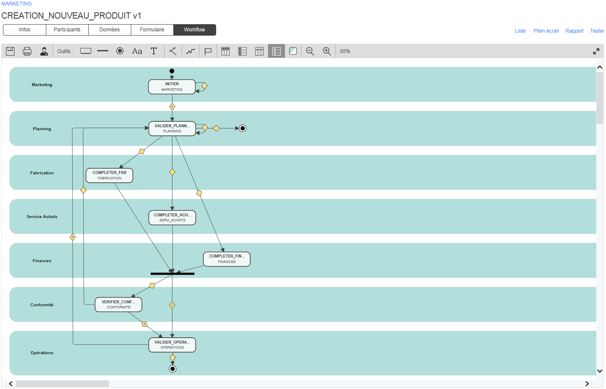

# Création d’un nouveau produit

L’objectif de ce processus est de gérer et d’optimiser les diverses étapes de la création d’un nouveau produit.

La proposition d’affaires est définie par le département du marketing, puis validée par le département du planning qui définit également le besoin de conformité réglementaire. Ensuite, le traitement en parallèle des étapes suivantes permet aux départements de fabrication, des achats et des finances d’analyser et de compléter la demande avec les données de référence (Master Data) associées avec leurs secteurs d’activités respectifs.

Le département des opérations finalise la demande en confirmant la date de lancement prévue et en autorisant la création d’une nouvelle référence dans l’ERP.

### Participants impliqués

* Marketing
* Planning
* Fabrication
* Achats
* Finance
* Conformité réglementaire
* Opérations

### Bénéfices

* L’automatisation et la parallélisation des activités réduisent considérablement les délais de traitement tout en augmentant la réactivité au sein de l’entreprise pour le lancement d’un nouveau produit.
* Gestion de la conformité réglementaire et accès aux archives en cas d’audit.
* Création, traitement et mise à jour des données de référence directement dans WorkflowGen.
* Élaboration de rapports personnalisés via la fonctionnalité Vue Avancée de WorkflowGen, qui fournit le suivi immédiat des demandes et des activités ainsi que la production instantanée d’indicateurs de performance afin d’améliorer le contrôle des activités.

### Exemples d’intégrations à valeur ajoutée

* Liaison des données des listes déroulantes avec des applications métiers, un ERP ou des listes globales gérées dans WorkflowGen.
* Création automatique d’une nouvelle référence dans l’ERP via une action système.
* Intégration avec les outils de planification.
* Initiation de sous-processus (indépendants ou intégrés) afin de simplifier le traitement des composants d’un processus de création d’un nouveau produit qui comprend plusieurs étapes.

### Workflow

### Formulaire

  
  
  

### Télécharger

[Téléchargez ce processus](dist/creation-nouveau-produitv1.xml.zip) et importez-le dans votre environnement WorkflowGen existant, ou [téléchargez la version gratuite de WorkflowGen](https://www.workflowgen.com/fr/telecharger-logiciel-workflow-gratuit/) et déployez le processus pour un nombre illimité d’utilisateurs. Exécutez le processus tel quel ou personnalisez le formulaire ainsi que la définition du workflow selon vos besoins spécifiques.

