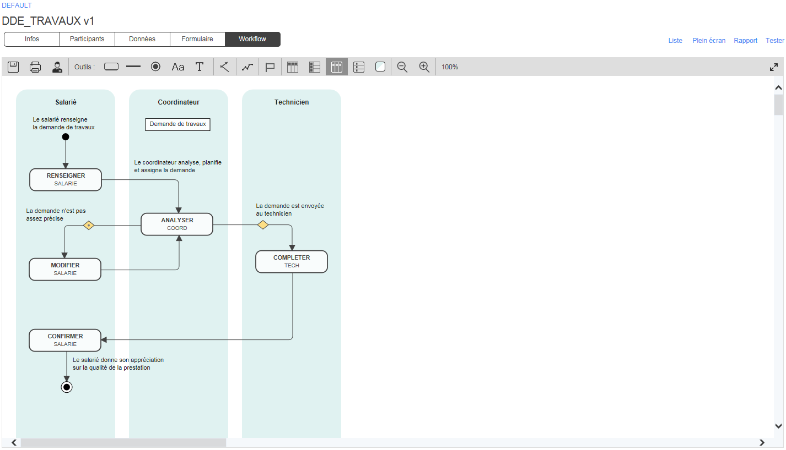
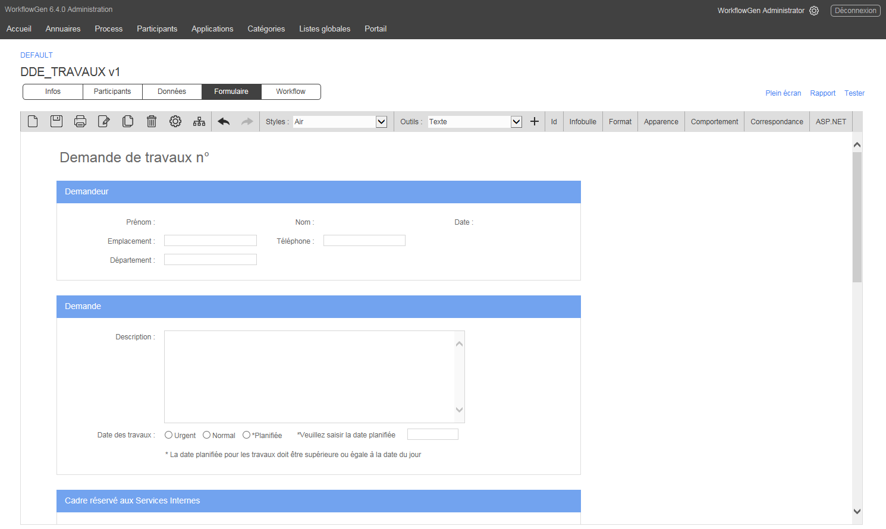
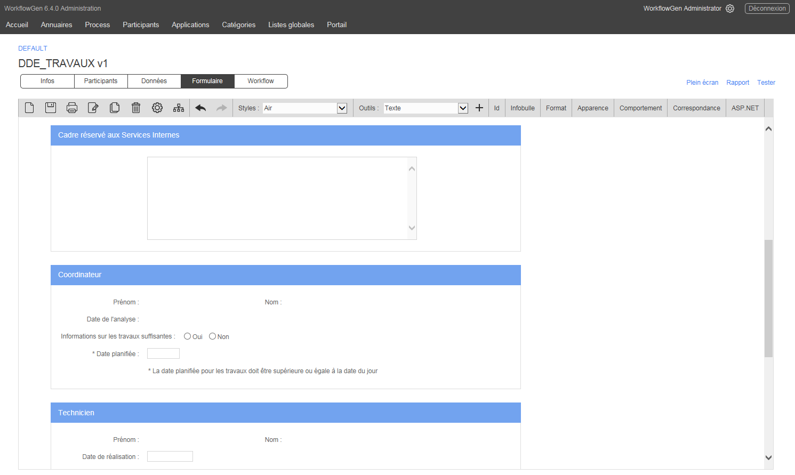
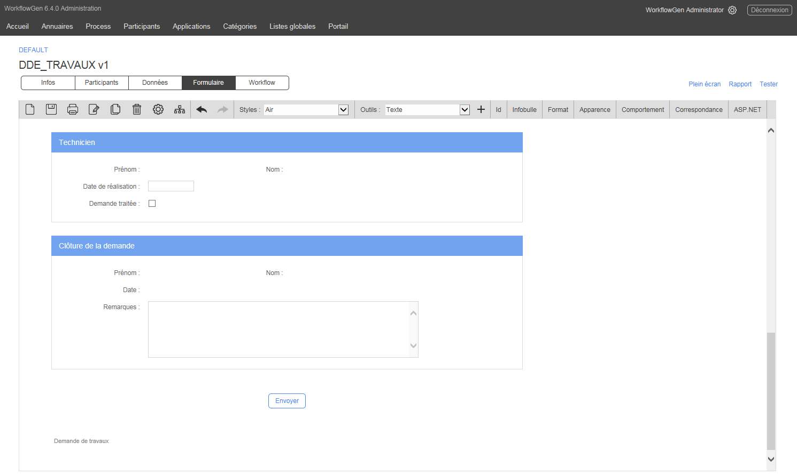

# Demande de travaux

L’objectif de ce processus est de gérer et d’optimiser les travaux et les réparations dans les édifices et les installations d’une entreprise, sur les campus universitaires et dans les zones géographiques gérées par des collectivités territoriales.

Le demandeur est le responsable local des installations; il lance une demande une fois que toutes les informations pertinentes sur l’emplacement et le type de travaux sont recueillies, et indique le niveau d’urgence et / ou l’échéance au besoin. Le directeur des installations analyse ensuite la demande et pourra obtenir plus d’informations du demandeur si nécessaire, puis il affecte la demande au technicien qui confirme la date des travaux. Une fois les travaux réalisés et l’assurance qualité passée, le demandeur clôture la demande.

### Participants impliqués

* Demandeur
* Directeur des installations
* Technicien

### Bénéfices

* Suivi du traitement de la demande de travaux par le demandeur en temps réel.
* Qualité de service améliorée et réduction des délais.
* Envoi des demandes de travaux aux techniciens par le coordinateur.
* Exploitation par les coordinateurs des fonctionnalités de suivi et de rapport intégrées dans WorkflowGen pour gérer efficacement le traitement des demandes de travaux.

### Exemples d’intégrations à valeur ajoutée

* Liaison des données des listes déroulantes avec des applications de gestion d’actifs immobiliers ou des listes globales gérées dans WorkflowGen afin de recueillir les informations sur les édifices, les bureaux, les salles de classe, etc...
* Applications mobiles iOS et Android WorkflowGen pour notifier les techniciens terrains des travaux à réaliser.
* Liaison de WorkflowGen aux services GPS afin d’affecter les tâches aux techniciens selon leurs emplacements actuels.
* Lancement de workflow par un demandeur sur le terrain avec la possibilité d’attacher une photo prise avec un appareil mobile afin de démontrer la nécessité de travaux ou de réparations.

### Workflow

### Formulaire

  
  

### Télécharger

[Téléchargez ce processus](dist/demande-travauxv1.xml.zip) et importez-le dans votre environnement WorkflowGen existant, ou [téléchargez la version gratuite de WorkflowGen](https://www.workflowgen.com/fr/telecharger-logiciel-workflow-gratuit/) et déployez le processus pour un nombre illimité d’utilisateurs. Exécutez le processus tel quel ou personnalisez le formulaire ainsi que la définition du workflow selon vos besoins spécifiques.

