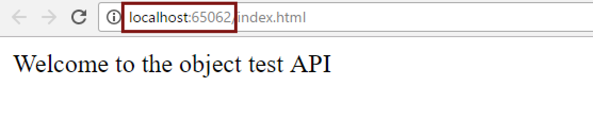
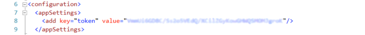
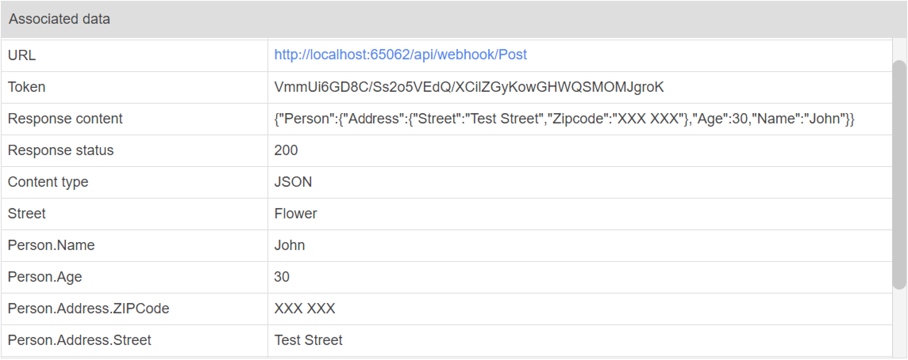

##SENDHTTPPOST Workflow Application

###Table of Contents

- [Introduction](#introduction)
- [Requirements](#requirements)
- [Installation](#installation)
- [Configuration](#configuration)
- [Test execution](#test-execution)
- [Troubleshooting](#troubleshooting)

###Introduction

The [WorkflowGen](https://www.workflowgen.com/) SENDHTTPPOST workflow application lets users send outgoing webhooks (HTTP post requests) to external systems. These examples will show you how the application performs when sending all supported data types, as well as how to use nested-level parameters to send and receive information from external sources.

The [Webhooks_Integration_Example_DataTypes](src/Webhooks_Integration_Example_DataTypes/) folder contains an example of an API that sends and receives JSON or URLENCODED payloads containing text, numeric, and datetime type data, processes them, and sends back a payload containing the three data types.

The [Webhooks_Integration_Example_Objects](src/Webhooks_Integration_Example_Objects/) folder contains an example of an API that receives nested JSON (using either the application/json or application/x-www-form-urlencoded content type), converts them into objects to process them, and sends back a payload containing another nested JSON. There is no limit to the number of levels in the nested JSON.

For more information on SENDHTTPPOST, see the **SENDHTTPPOST workflow application** section in the **WorkflowGen Administration Module Reference Guide**, available on the [WorkflowGen Documentation](https://www.workflowgen.com/resources/documentation/) page.

###Requirements

These examples require that you have the SENDHTTPPOST application installed in your WorkflowGen environment (available as of version 6.6.0), and Visual Studio to open and run the solutions.

###Installation

1. Download the [Webhooks_Integration_Example_Objects] and [Webhooks_Integration_Example_DataTypes] folders from GitHub.

2. Open the folder related to the example (**DataTypes** or **Objects**) that you want to test from the local path where you saved it, then open the *.sln file in Visual Studio.

3. Run the solution in Visual Studio. This will open your default browser (or the browser you selected in Visual Studio to run the project) or open a new tab in an already-open browser, displaying an HTML page with a welcome message.

4. You can also publish your API in IIS (this step is optional). If you do this, you don't need the API running in Visual Studio while testing.

<a id="configuration">
###Configuration

In the WorkflowGen Administration Module home page, click the **New process** button and import the *.xml file that corresponds to the test project (contained in the [LOCAL PATH]\Webhooks_Integration_[SELECTED EXAMPLE]).

###Test execution

1. Click the process's link on the home page.

2. Click **Test** to start the process test.

3. Fill in the form. 

 **URL** should contain the running or published API base URL address (hostname:port number). The "/index.html" part is not required. You can get the URL from your browser.

 

 Build the URL using **[API base URL]/api/webhook/Post** if you want to send your payload using the application/json content type, or **[API base URL]/api/webhook/PostWithPayload** if you want to use the application/x-www-form-urlencoded content type.
 
 For example, if you want to test the DataTypes API, your URL field would be as follows: 

  - Content type: application/json: **http://localhost:65062/api/webhook/Post**

  - Content type: application/x-www-form-urlencoded: **http://localhost:65062/api/webhook/PostWithPayload**

 **Token:** Both sample APIs require tokens for authentication. You can get the token value from the web.config file contained in each solution.

 

 **Content type:** If you don't choose a value from the drop-down list, JSON will be the default value.

 **Objects example:** For the Objects example, fill in the **Person.Name**, **Person.Age**, **Person.Address.Street**, and **Person.Address.ZipCode** text boxes with the corresponding name, age, street, and zip code values.

 **DataType example:** For the DataType example, the fields should contain the correct data type format (numeric for **Number**, datetime for **Date**, and text for **Name**).

4. Click the **Submit** button. You will get a results page like the following:

 

 In the case of the Objects example, you can also receive a nested JSON containing object properties (e.g. Person.Name, Person.Address.City). The DataTypes example can receive OUT parameters from all supported data types (Text, Numeric, and DateTime)

###Troubleshooting

If the test results page shows 401 as a Response status value, this means that the token provided is wrong, or you didn't provide a token value in the form. Check your token value (contained in the API web.config file) and enter it in the Token text box in the form.

If the action is cancelled, verify that the URL value and the content type value correspond to the same content type, for example:

- **JSON:** http://localhost:65062/api/webhook/Post with JSON or an empty value in the content type drop-down list

- **URLENCODED:** http://localhost:65062/api/webhook/PostWithPayload with URLENCODED as the value in the content type drop-down list 

