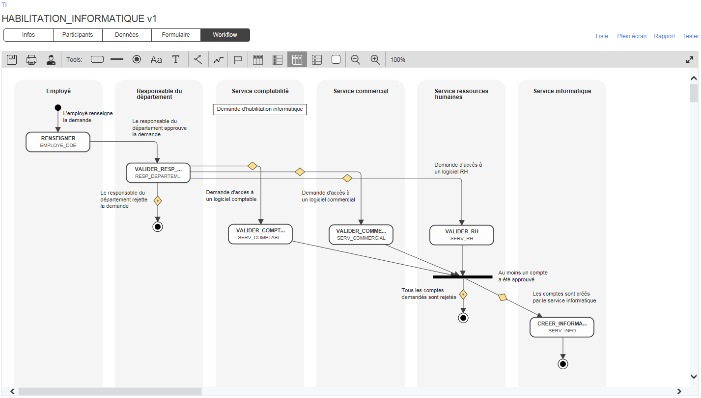
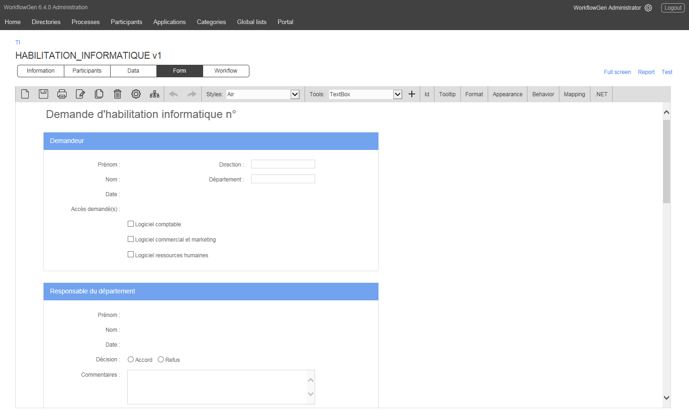
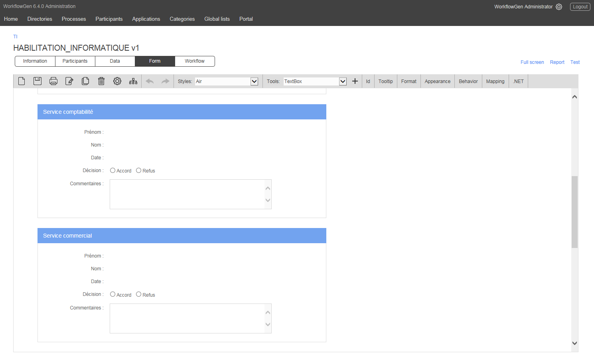
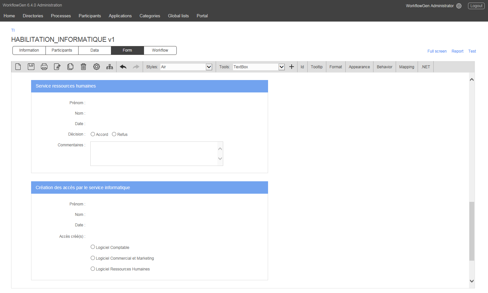

# Demande d’habilitation informatique

L’objectif de ce processus est d’optimiser le traitement des demandes d’habilitation informatique qui concernent plusieurs départements de l’entreprise.

Le superviseur de l’employé pour lequel la demande est soumise sélectionne les applications pour lesquelles il requiert l’habilitation. Le directeur du département valide la demande et une fois approuvée, les divers services en charge des applications demandées peuvent transmettre leurs décisions en parallèle. WorkflowGen synchronise les réponses des services et selon les décisions, la demande est envoyée au département d’informatique qui ensuite créera les comptes nécessaires.

### Participants impliqués

* Demandeur
* Superviseur
* Directeur du département
* Service commercial
* Comptabilité
* Ressources humaines
* Département d’informatique

### Bénéfices

* Suivi du traitement de la demande par le demandeur en temps réel.
* Qualité de service améliorée et réduction des délais.
* Actions des participants parallélisées et synchronisées par WorkflowGen réduisant considérablement les délais de traitement.
* Applications des standards informatiques et meilleurs pratiques (ex. : ITIL).
* Traçabilité des demandes et archivage automatique des demandes clôturées.

### Exemples d’intégrations à valeur ajoutée

* Liaison des données des listes déroulantes avec un référentiel comprenant les modules d’applications, les sous-modules et les profils d’utilisateurs, ou aux listes globales gérées dans WorkflowGen.
* Sélection depuis des listes d’applications générées selon les fonctions des demandeurs.
* Les approbations des participants impliqués lancent une action système qui crée les comptes utilisateurs directement dans les applications et transmet les informations aux demandeur sans nécessiter une intervention humaine du département informatique.
* Les demandes d’habilitation informatique alimentent un référentiel d’applications qui gère les permissions des utilisateurs, et qui peut également gérer les modifications des comptes utilisateurs ou les processus de suppression.
* Les demandes d’habilitation informatique peuvent être intégrées en tant que sous-processus des processus de gestion des nouveaux employés.
* Les dates d’expiration peuvent être associées aux comptes, permettant à WorkflowGen de lancer automatiquement des processus d’extension ou de suppression des comptes utilisateurs.

### Workflow

### Formulaire

  
  

### Télécharger

[Téléchargez ce processus](dist/habilitation-informatiquev1.xml.zip) et importez-le dans votre environnement WorkflowGen existant, ou [téléchargez la version gratuite de WorkflowGen](https://www.workflowgen.com/fr/telecharger-logiciel-workflow-gratuit/) et déployez le processus pour un nombre illimité d’utilisateurs. Exécutez le processus tel quel ou personnalisez le formulaire ainsi que la définition du workflow selon vos besoins spécifiques.

