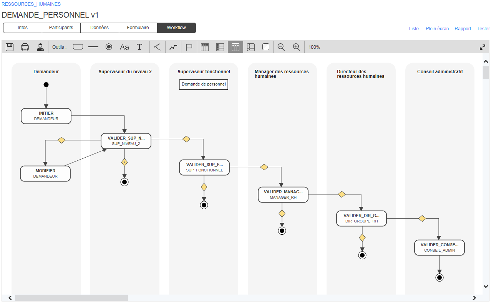
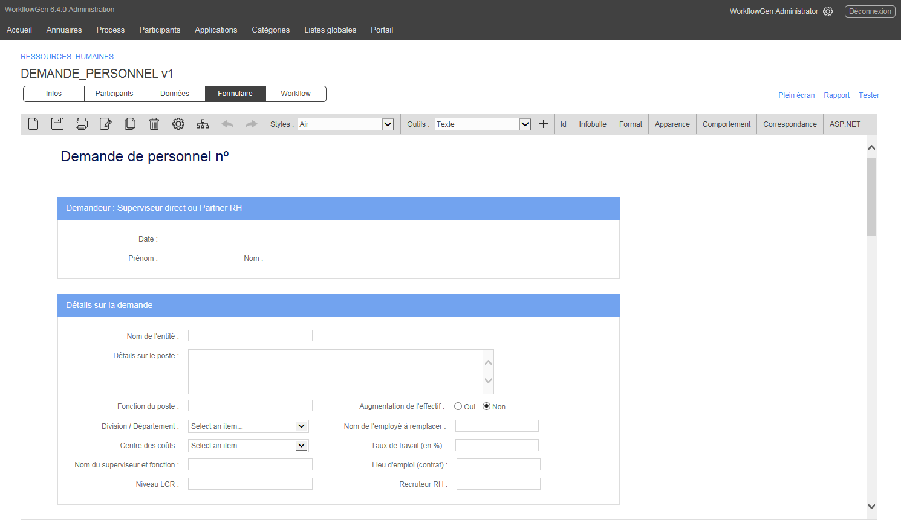
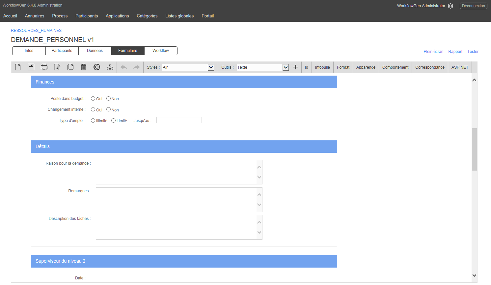
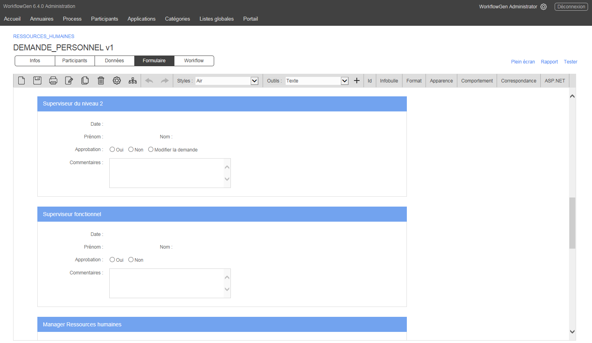
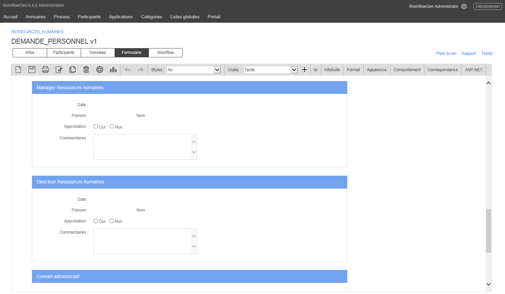
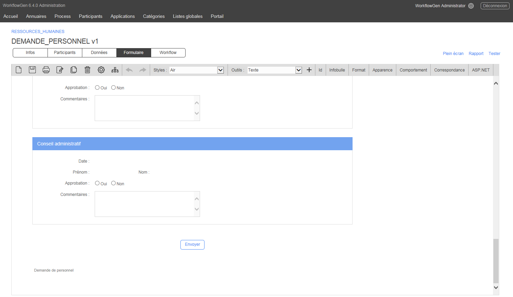

# Demande de personnel

L’objectif de ce processus est de dématérialiser et d’optimiser la gestion des demandes de personnel. Ce processus est le premier d’une série qui peuvent être liés, menant à l’embauche d’un nouvel employé.

D’abord, le directeur du département définit la raison de la demande et fournit des informations sur le poste et le profil du candidat souhaité, notamment les qualifications et expériences exigées, le type de contrat, le salaire et la date de début prévue du nouvel employé.

Le département des ressources humaines valide la demande, puis vérifie que tous les éléments sont complets et correspondent aux politiques et aux normes d’embauche de la société, notamment en ce qui concerne le salaire et la possibilité de combler le poste en interne. Si nécessaire, un dialogue pourrait être initié entre le superviseur du département demandeur et les ressources humaines. Une fois approuvée par les ressources humaines, la décision d’embauche décrivant le poste proposé et le salaire est soumise au conseil d’administration ou au directeur général.

### Participants impliqués

* Demandeur
* Superviseur du niveau 2
* Superviseur fonctionnel
* Manager des ressources humaines
* Directeur des ressources humaines
* Conseil administratif

### Bénéfices

* Les départements peuvent communiquer directement leurs besoins d’embauche en quelques clics dans un formulaire intelligent qui les oriente à travers la description du poste et les critères demandés sans avoir à consulter le département des ressources humaines.
* L’amélioration des délais de traitement des demandes de personnel permet à la société d’être plus réactive aux besoins de remplacement de personnel ou aux augmentations d’activités qui nécessitent de nouvelles embauches.

### Exemples d’intégrations à valeur ajoutée

* Liaison de données des listes déroulantes avec les ressources humaines ou avec des applications ERP qui gèrent les types de contrats d’emploi, de profils, de descriptions de tâches, de conditions d’emploi, de grilles salariales, de listes d’employés en cas de remplacement, etc... Les listes déroulantes sont interconnectées afin d’aider les utilisateurs lors de la détermination des critères pour le nouvel employé.
* Une fois la demande de personnel approuvée, WorkflowGen peut automatiquement lancer le processus de diffusion des offres d’emplois, suivi par le traitement des profils de candidats et l’organisation des entrevues, en finissant par la sélection du candidat et la rédaction du contrat de travail.

### Workflow

### Formulaire

  
  
  
  

### Télécharger

[Téléchargez ce processus](dist/demande-personnelv1.xml.zip) et importez-le dans votre environnement WorkflowGen existant. Exécutez le processus tel quel ou personnalisez le formulaire ainsi que la définition du workflow selon vos besoins spécifiques.

