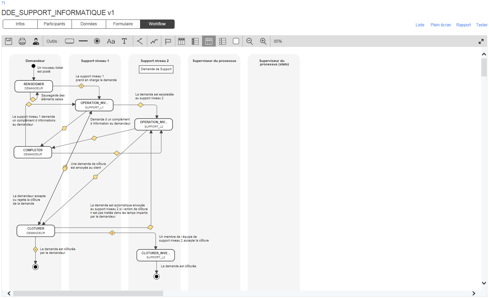
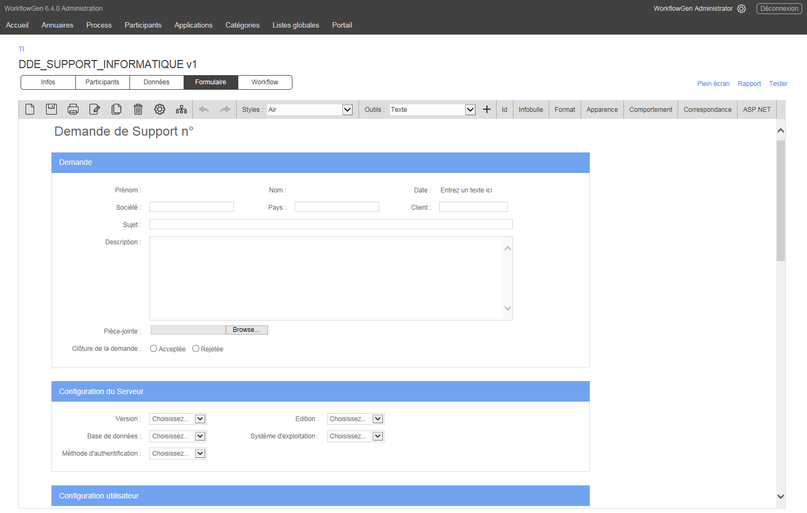
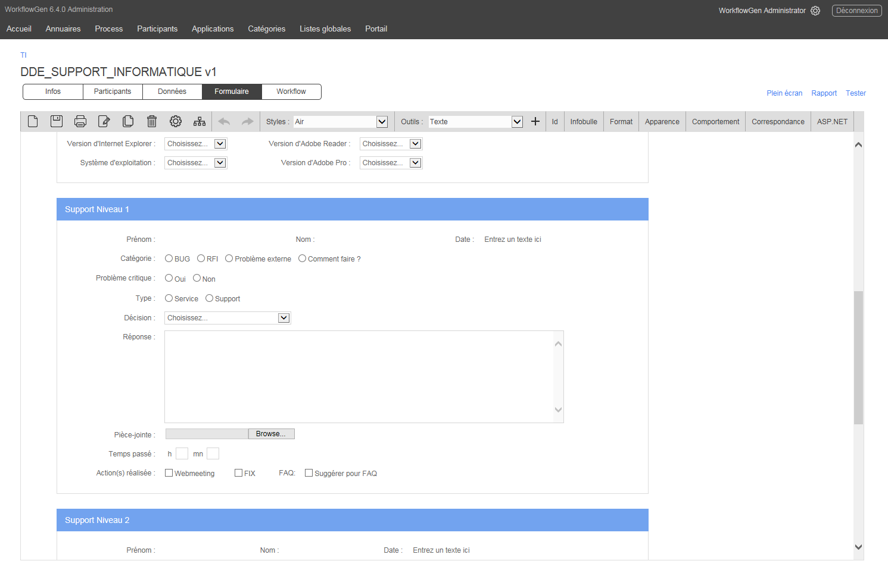
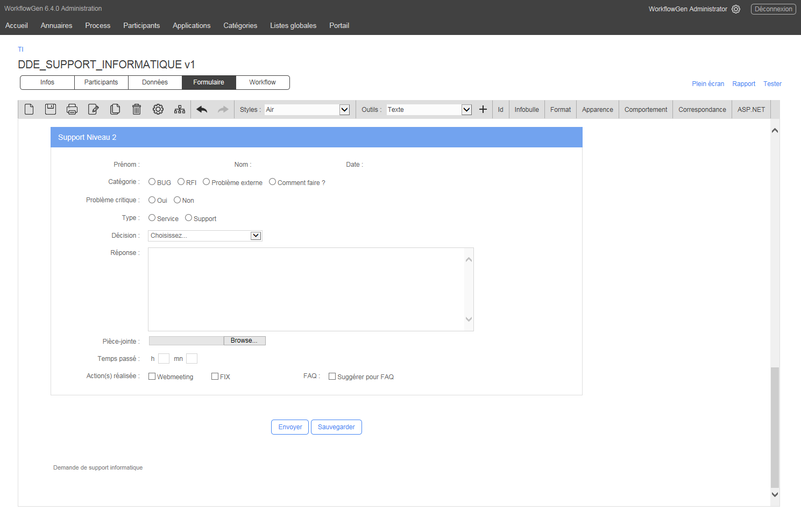

# Demande de support informatique

L’objectif de ce processus est de gérer et d’optimiser la prise en charge, le traitement et la résolution des demandes de support informatique des clients internes et externes.

Le client lance une demande \(un « ticket » de support\) et décrit le problème survenu au niveau logiciel, applicatif ou matériel en fournissant autant d’informations que possible afin de faciliter la compréhension du problème et la cause potentielle. Le support de niveau 1 qualifie le ticket et détermine quelles mesures sont à prendre, telles qu’une demande d’informations complémentaires au demandeur, l’initiation d’un appel ou d’une session distante, l’envoi d’une solution, ou une escalade au support de niveau 2. Une fois que l’équipe de support aura résolu le problème, le ticket sera fermé.

### Participants impliqués

* Demandeur
* Support de niveau 1
* Support de niveau 2
* Superviseur

### Bénéfices

* Suivi du ticket de support par le demandeur en temps réel.
* Qualité de service améliorée, délais de traitement des résolutions des tickets de support réduits.
* Affectation et traitement des actions d’équipe en mode « self-service » par le premier préposé disponible.
* La catégorisation du ticket par le premier niveau de support et l’escalade au deuxième niveau si nécessaire, optimise l’utilisation d’expertise requise pour résoudre le problème.
* Application des standards et des meilleures pratiques de support (ex. : ITIL).
* Tirer avantage des résolutions des tickets pour les problèmes similaires via des champs et listes déroulantes préremplis, et recherche dans la base de connaissances.
* Exploitation des fonctionnalités de suivi et de rapport intégrées de WorkflowGen par les superviseurs des équipes de support afin de coordonner le traitement des tickets.

### Exemples d’intégrations à valeur ajoutée

* Liaison des données depuis les listes déroulantes du formulaire aux applications de gestion des ressources informatiques ou aux listes globales gérées dans WorkflowGen afin de recueillir les informations sur les configurations logicielles et matérielles du demandeur.
* Mise à jour de la base de connaissances via une action système à la fin du processus.
* Lancement automatique de demandes de support préremplis provenant d’alertes d’applications tierces.

### Workflow

### Formulaire

  
  

### Télécharger

[Téléchargez ce processus](dist/demande-support-informatiquev1.xml.zip) et importez-le dans votre environnement WorkflowGen existant, ou [téléchargez la version gratuite de WorkflowGen](https://www.workflowgen.com/fr/telecharger-logiciel-workflow-gratuit/) et déployez le processus pour un nombre illimité d’utilisateurs. Exécutez le processus tel quel ou personnalisez le formulaire ainsi que la définition du workflow selon vos besoins spécifiques.