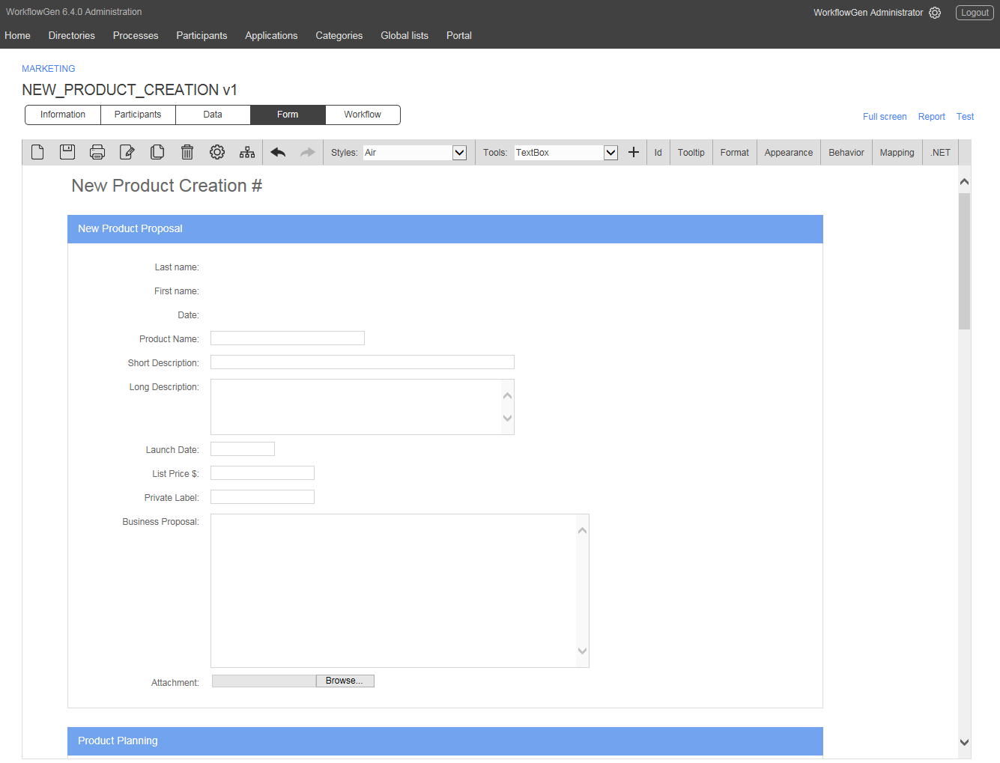
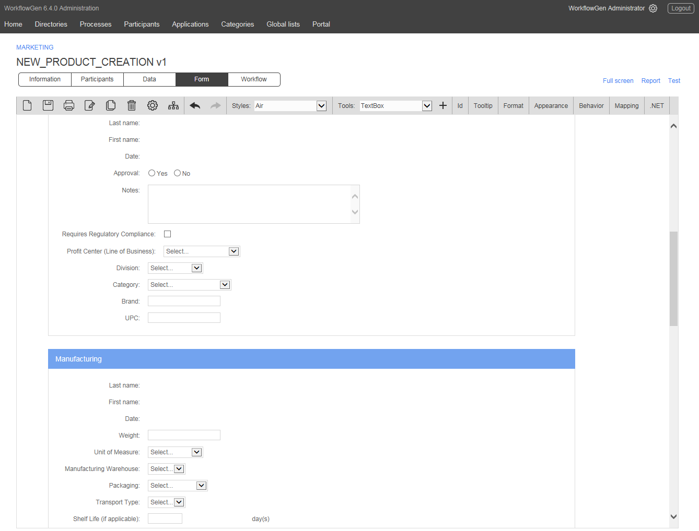
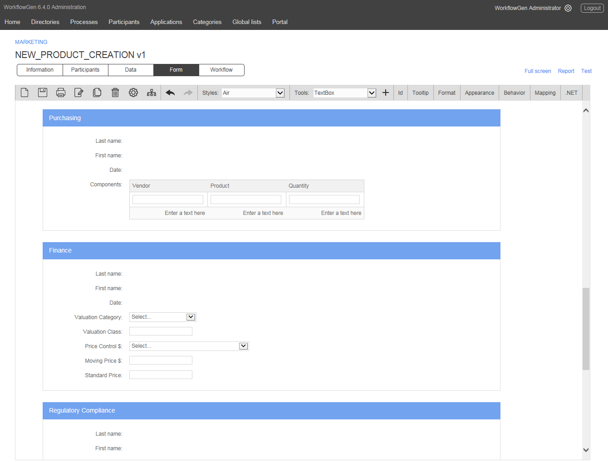
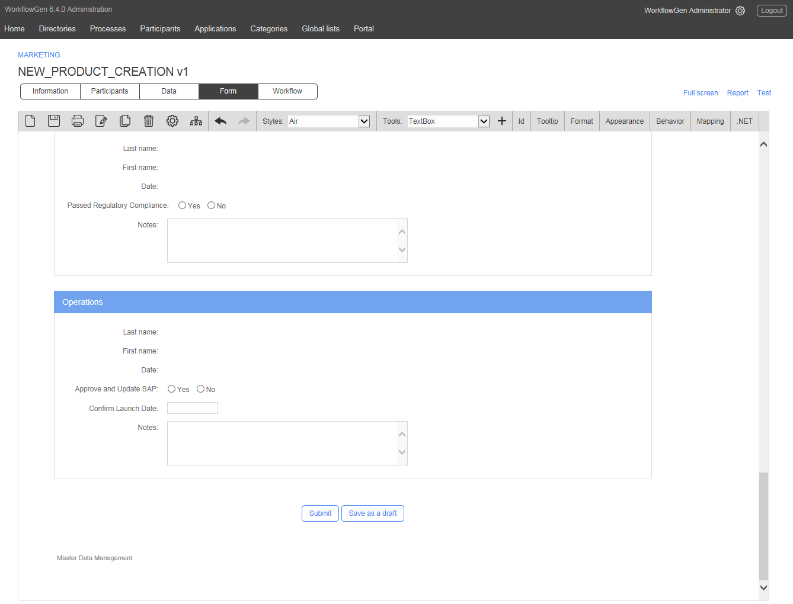
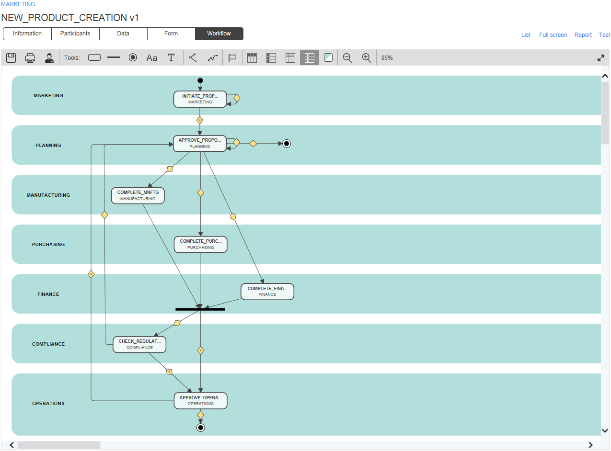

# New Product Creation

The objective of this process is to manage and optimize the various steps in the creation of a new product.

The business proposal is defined by the Marketing Department, then validated by Planning, which also determines the need for regulatory compliance. Then, parallel processing of the subsequent process steps allows Manufacturing, Purchasing, and Finance to analyze and complete the request with Master Data associated with their respective areas of activity.

The Operations Department finalizes the request by confirming the anticipated launch date and authorizing the creation of a new reference in the ERP.

### Participants involved

* Marketing
* Planning
* Manufacturing
* Purchasing
* Finance
* Regulatory Compliance
* Operations

### Benefits

* Automation and parallelization of activities, greatly reducing processing time while increasing responsiveness within the enterprise for the launch of a new product.
* Facilitation of the follow-up of request processing, whose duration can be extended.
* Management of regulatory compliance and access to records in case of audit.
* Creation, handling, and updating of Master Data directly within WorkflowGen.
* Elaboration of personalized reports via the Advanced View function in WorkflowGen, providing immediate follow-up of requests and activities, along with instant generation of performance indicators allowing for better activity monitoring.

### Examples of value-added integration

* Databinding of form drop-down lists to business applications, ERP, or global lists managed within WorkflowGen.
* Automatic creation of a new ERP reference via a system action.
* Integration with planning tools.
* Initiation of sub-processes \(independent or integrated\) in order to simplify the processing of components of a new product creation process that comprises numerous steps.

### Screenshots

  
  
  
  

### Download

 and import it into your existing WorkflowGen environment or simply request a free trial version \(on-premise or hosted\). Run the process as-is or fully customize the form as well as the workflow definition to meet your specific needs.

