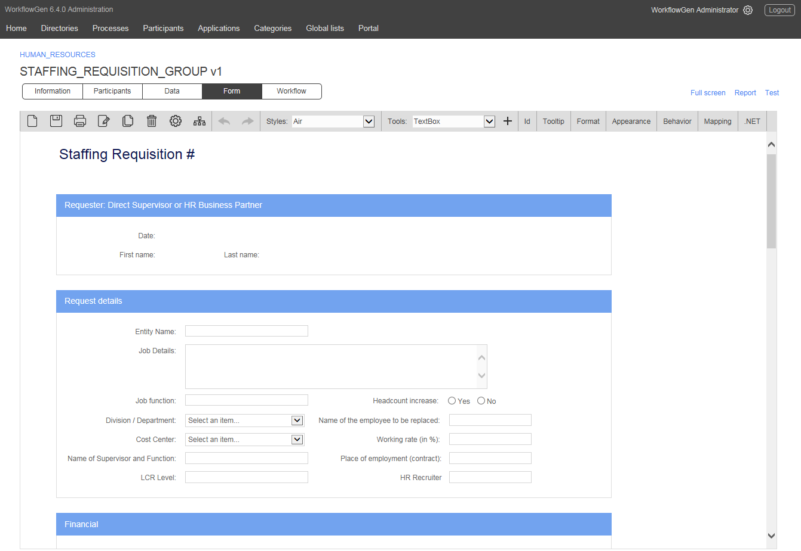
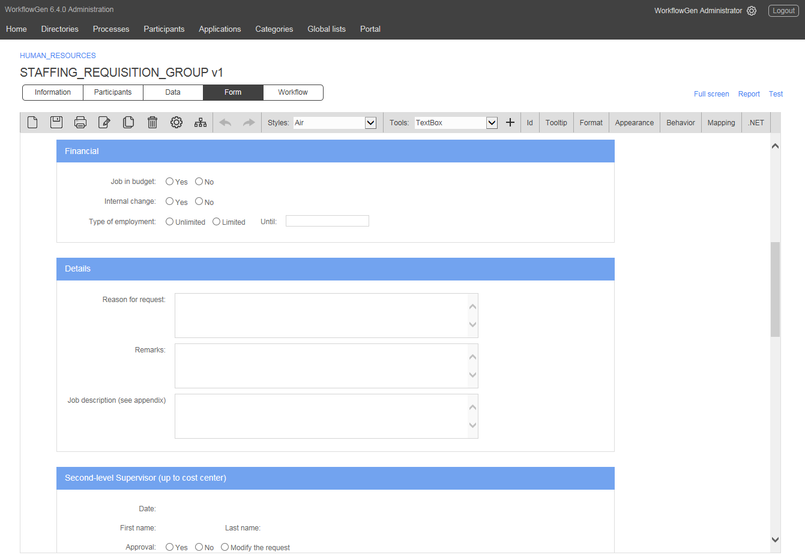
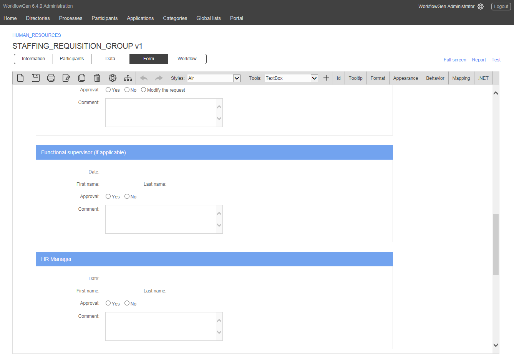
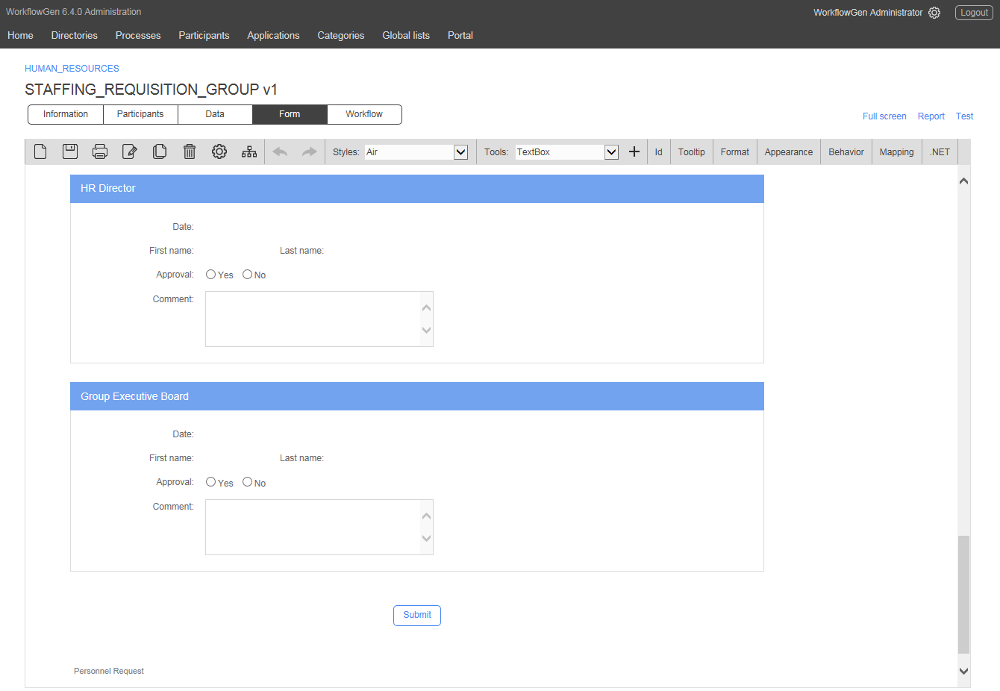

# Staffing Requisition

The objective of this process is to dematerialize and optimize the management of staffing requisitions. This is the first part of a series of processes that can be linked, leading to the hiring of a new employee.

The department director first elaborates the rationale for the request and provides information on the position and the desired candidate profile, notably the requisite qualifications and experience, the type of contract, the salary, and the anticipated start date of the new hire.

Human Resources will validate the merits of the request, then verify that all elements are complete and correspond to the company’s policies and hiring standards, notably in terms of salary and whether the position can be filled internally. If necessary, a dialogue can be initiated between the requesting department supervisor and Human Resources. Upon HR approval, the hiring decision outlining the prospective position and salary is submitted to the Group Executive Board or CEO.

### Participants involved

* Requester
* Second-level Supervisor
* Functional Supervisor
* Human Resources Manager
* Human Resources Director
* Group Executive Board

### Benefits

* Departments can directly signal their hiring needs through a few clicks on an intelligent form that guides them through the description of the position and the requested criteria, without having to first consult HR.
* The improvement in processing time for staffing requisitions allows the company to be more responsive to employee replacement needs or increases in activity that necessitate new hiring.

### Examples of value-added integration

* Databinding of form drop-down lists with HR or ERP applications that manage the types of available employment contracts, profiles, job descriptions, employment terms, salary scales, employee lists in cases of replacement, etc. Drop-down lists are interlinked in order to guide the user in the determination of criteria for the new hire.
* Once the staffing requisition is approved, WorkflowGen can automatically launch the process of job posting logistics, followed by the processing of candidate profiles and organizing interviews, culminating in candidate selection and drafting the employment contract.

### Workflow

### Form

  
  
  

### Download

 and import it into your existing WorkflowGen environment or simply request a free trial version \(on-premise or hosted\). Run the process as-is or fully customize the form as well as the workflow definition to meet your specific needs.

